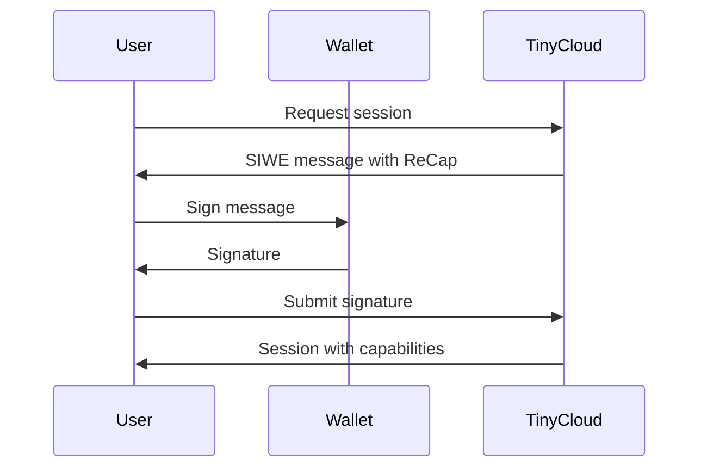
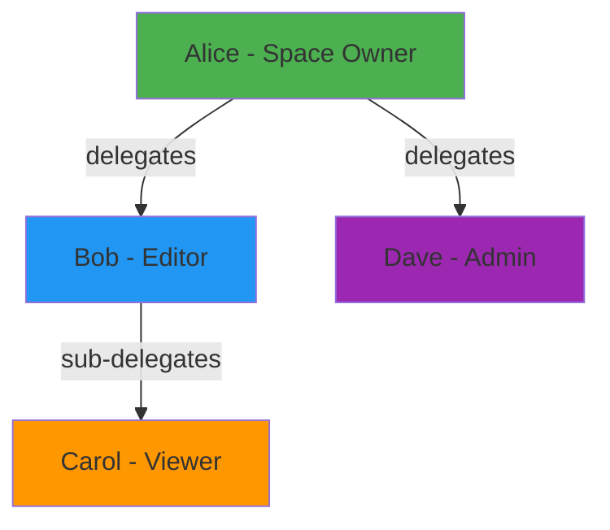

TinyCloud uses a capability-based authorization system built on UCAN (User Controlled Authorization Networks) and integrated with SIWE (Sign-In with Ethereum) through ReCap (Resource Capability).

## UCAN Fundamentals

UCAN is a decentralized authorization framework where capabilities are:

- **Bearer tokens**: Whoever holds the token can use the capability
- **Self-certifying**: No central authority needed to verify
- **Delegatable**: Users can grant subsets of their capabilities to others
- **Cryptographically signed**: Tamper-proof and verifiable

When you authenticate with TinyCloud, your wallet signs a SIWE message that includes ReCap capabilities. This creates a root UCAN that defines what actions you can perform.

## ReCap Integration

ReCap embeds capability claims within SIWE messages, allowing Ethereum wallets to authorize specific actions. The flow works as follows:



## Ability String Format

TinyCloud uses a hierarchical ability string format:

```
tinycloud.{resource}/{action}
```

### Key-Value Operations

| Ability | Description |
|---------|-------------|
| `tinycloud.kv/get` | Read values from the key-value store |
| `tinycloud.kv/put` | Write values to the key-value store |
| `tinycloud.kv/del` | Delete values from the key-value store |
| `tinycloud.kv/list` | List keys in the key-value store |
| `tinycloud.kv/metadata` | Read metadata about stored values |

### Space Operations

| Ability | Description |
|---------|-------------|
| `tinycloud.space/host` | Access a space as a participant |
| `tinycloud.space/admin` | Full administrative control over a space |

### Capability Operations

| Ability | Description |
|---------|-------------|
| `tinycloud.capabilities/read` | Read and verify capability chains |

### Path Scoping

Abilities can be scoped to specific paths within a space:

```typescript
// Full access to all keys
"tinycloud.kv/put"

// Access only to keys under /users/alice/
"tinycloud.kv/put" with path: "/users/alice/"
```

## Delegation Chains

One of UCAN's most powerful features is the ability to delegate capabilities to others. TinyCloud enforces strict rules to ensure security.

### Delegation Hierarchy



### Constraint Rules

When creating a delegation, the child capability must be a subset of the parent:

<AccordionGroup>
  <Accordion title="Expiry Constraint">
    **Child expiry must be less than or equal to parent expiry.**

    If Alice's capability expires on January 15, any delegation she creates must expire on or before January 15.

    ```typescript
    // Alice's capability expires in 24 hours
    // This delegation is valid (12 hours < 24 hours)
    await alice.createDelegation({
      delegateDID: bob.pkhDid,
      expiresIn: 12 * 60 * 60 // 12 hours
    });

    // This would fail (48 hours > 24 hours)
    await alice.createDelegation({
      delegateDID: bob.pkhDid,
      expiresIn: 48 * 60 * 60 // 48 hours - INVALID
    });
    ```
  </Accordion>

  <Accordion title="not_before Constraint">
    **Child not_before must be greater than or equal to parent not_before.**

    A delegation cannot become valid before the parent capability is valid.
  </Accordion>

  <Accordion title="Action Subset Constraint">
    **Child actions must be a subset of parent actions.**

    You cannot delegate capabilities you do not have.

    ```typescript
    // Alice has: kv/get, kv/put, kv/del

    // Valid: subset of Alice's capabilities
    await alice.createDelegation({
      delegateDID: bob.pkhDid,
      abilities: ["tinycloud.kv/get", "tinycloud.kv/put"]
    });

    // Invalid: Alice cannot delegate kv/list
    await alice.createDelegation({
      delegateDID: bob.pkhDid,
      abilities: ["tinycloud.kv/list"] // FAILS - Alice doesn't have this
    });
    ```
  </Accordion>

  <Accordion title="Path Constraint">
    **Child path must be within parent path.**

    If Alice can only access `/projects/alpha/`, she can delegate access to `/projects/alpha/docs/` but not to `/projects/beta/`.

    ```typescript
    // Alice's scope: /projects/alpha/

    // Valid: within Alice's scope
    await alice.createDelegation({
      delegateDID: bob.pkhDid,
      path: "/projects/alpha/docs/"
    });

    // Invalid: outside Alice's scope
    await alice.createDelegation({
      delegateDID: bob.pkhDid,
      path: "/projects/beta/" // FAILS
    });
    ```
  </Accordion>
</AccordionGroup>

### Preventing Sub-delegation

To prevent further delegation of capabilities, use the `disableSubDelegation` flag:

```typescript
await alice.createDelegation({
  delegateDID: bob.pkhDid,
  abilities: ["tinycloud.kv/get"],
  disableSubDelegation: true
});

// Bob now CANNOT create further delegations from this capability
```

This is useful when you want to grant access to a specific user without allowing them to share that access with others.

## Revocation

Capabilities can be revoked before their expiry. When a capability in the chain is revoked:

- The revoked capability becomes invalid immediately
- All downstream delegations derived from it also become invalid
- The revocation is permanent for that specific token

<Note>
Revocation propagates down the chain. If Alice revokes Bob's delegation, Carol's sub-delegation from Bob also becomes invalid.
</Note>

## Best Practices

1. **Principle of least privilege**: Delegate only the minimum capabilities needed
2. **Short expiry times**: Use shorter expiry periods for sensitive operations
3. **Path scoping**: Limit access to specific paths rather than entire spaces
4. **Disable sub-delegation**: When the recipient should not share access further
5. **Use PKH DIDs**: Always use `.pkhDid` for the delegatee (see [DID Formats](/concepts/did-formats))
