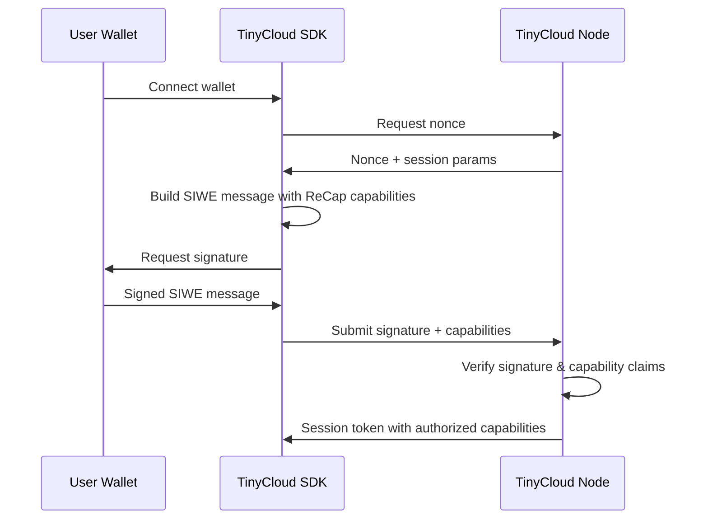
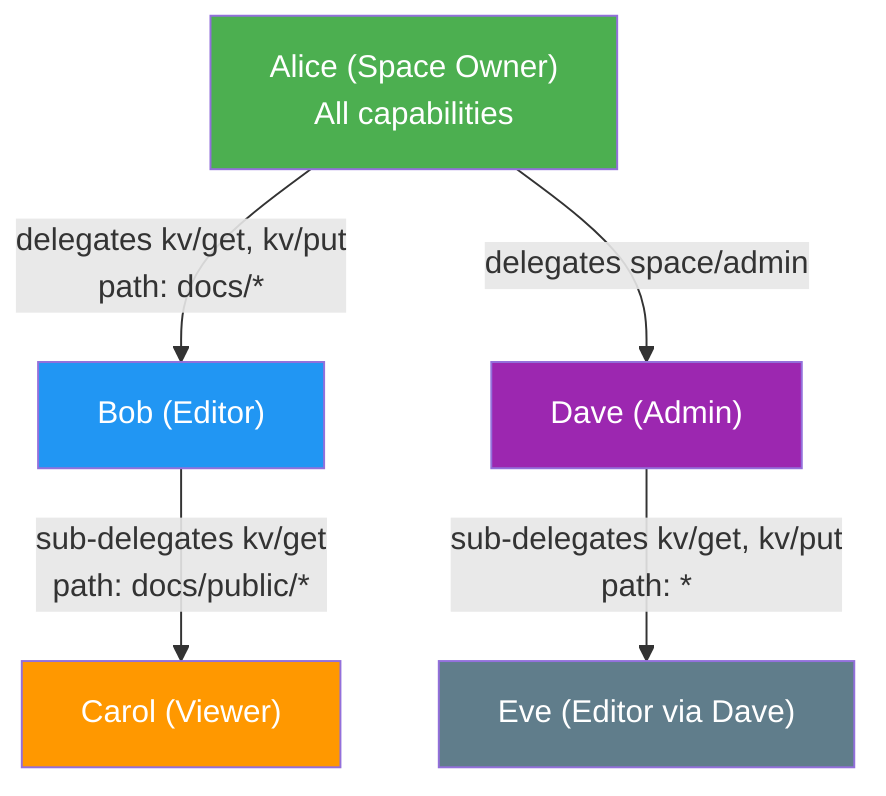
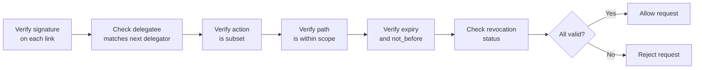

TinyCloud uses a capability-based authorization system built on UCAN (User Controlled Authorization Networks) and integrated with SIWE (Sign-In with Ethereum) through ReCap (Resource Capability).

## UCAN Fundamentals

UCAN is a decentralized authorization framework where capabilities are:

- **Bearer tokens**: Whoever holds the token can use the capability
- **Self-certifying**: No central authority needed to verify -- the token itself contains proof
- **Delegatable**: Users can grant subsets of their capabilities to others
- **Cryptographically signed**: Tamper-proof and verifiable by anyone

Unlike traditional API keys or OAuth tokens, UCANs do not require a round-trip to a central server for validation. The entire proof chain is embedded in the token itself.

## ReCap Integration with SIWE

ReCap embeds capability claims within SIWE (Sign-In with Ethereum) messages, allowing Ethereum wallets to authorize specific actions as part of the sign-in flow.



The SIWE message includes a ReCap object that declares which abilities the session is authorized to perform. This creates the root UCAN from which all delegations descend.

## Ability String Format

TinyCloud uses a hierarchical ability string format to define specific actions:

```
tinycloud.{resource}/{action}
```

The `tinycloud.` prefix is the ReCap ability namespace (a spec-level concept), followed by the resource type and the specific action.

### Key-Value Operations

| Ability | Description |
|---------|-------------|
| `tinycloud.kv/get` | Read values from the key-value store |
| `tinycloud.kv/put` | Write values to the key-value store |
| `tinycloud.kv/del` | Delete values from the key-value store |
| `tinycloud.kv/list` | List keys in the key-value store |
| `tinycloud.kv/metadata` | Read metadata about stored values |

### Space Operations

| Ability | Description |
|---------|-------------|
| `tinycloud.space/host` | Access a space as a participant |
| `tinycloud.space/admin` | Full administrative control over a space |

### Capability Operations

| Ability | Description |
|---------|-------------|
| `tinycloud.capabilities/read` | Read and verify capability chains |

## Path Scoping

Abilities can be scoped to specific key paths within a space. This limits what a capability holder can access, even within the same resource type.

```typescript
// Full access to all keys in the KV store
await tc.createDelegation({
  delegateDID: bob.did,
  abilities: ["tinycloud.kv/put"],
  // No path restriction - can write anywhere
});

// Scoped access: only keys under /users/alice/
await tc.createDelegation({
  delegateDID: bob.did,
  abilities: ["tinycloud.kv/put"],
  paths: ["/users/alice/*"],
  // Bob can write to /users/alice/profile but NOT /users/bob/profile
});
```

Path scoping is enforced at the server level. Requests outside the allowed path are rejected even if the capability token is otherwise valid.

## Delegation Chains

One of UCAN's most powerful features is the ability to delegate capabilities to others. Each delegation creates a link in a verifiable chain.

### Delegation Hierarchy



Each link in the chain must be a subset of the parent. Alice grants Bob write access to `docs/*`; Bob can sub-delegate read access to `docs/public/*` to Carol, but Bob cannot grant Carol write access or access outside `docs/*`.

### Constraint Rules

When creating a delegation, the child capability must be a strict subset of the parent across all dimensions:

<AccordionGroup>
  <Accordion title="Expiry Constraint">
    **Child expiry must be less than or equal to parent expiry.**

    If Alice's capability expires on January 15, any delegation she creates must expire on or before January 15.

    ```typescript
    // Alice's capability expires in 24 hours
    // This delegation is valid (12 hours < 24 hours)
    await alice.createDelegation({
      delegateDID: bob.did,
      expiry: new Date(Date.now() + 12 * 60 * 60 * 1000), // 12 hours
    });

    // This would fail (48 hours > 24 hours)
    await alice.createDelegation({
      delegateDID: bob.did,
      expiry: new Date(Date.now() + 48 * 60 * 60 * 1000), // REJECTED: exceeds parent expiry
    });
    ```
  </Accordion>

  <Accordion title="not_before Constraint">
    **Child not_before must be greater than or equal to parent not_before.**

    A delegation cannot become valid before the parent capability is valid. This prevents backdating attacks where a sub-delegation could be used before the original grant was intended to be active.

    ```typescript
    // Parent is valid starting Jan 10
    // Child must start on or after Jan 10
    await alice.createDelegation({
      delegateDID: bob.did,
      notBefore: '2026-01-12T00:00:00Z', // Valid: after parent's not_before
    });
    ```
  </Accordion>

  <Accordion title="Action Subset Constraint">
    **Child actions must be a subset of parent actions.**

    You cannot delegate capabilities you do not have.

    ```typescript
    // Alice has: kv/get, kv/put, kv/del

    // Valid: subset of Alice's capabilities
    await alice.createDelegation({
      delegateDID: bob.did,
      abilities: ["tinycloud.kv/get", "tinycloud.kv/put"],
    });

    // Invalid: Alice does not have kv/list
    await alice.createDelegation({
      delegateDID: bob.did,
      abilities: ["tinycloud.kv/list"], // REJECTED: not in parent's set
    });
    ```
  </Accordion>

  <Accordion title="Path Constraint">
    **Child path must be within parent path.**

    If Alice can only access `/projects/alpha/`, she can delegate access to `/projects/alpha/docs/` but not to `/projects/beta/`.

    ```typescript
    // Alice's scope: /projects/alpha/*

    // Valid: within Alice's scope
    await alice.createDelegation({
      delegateDID: bob.did,
      paths: ["/projects/alpha/docs/*"],
    });

    // Invalid: outside Alice's scope
    await alice.createDelegation({
      delegateDID: bob.did,
      paths: ["/projects/beta/*"], // REJECTED: not within parent path
    });
    ```
  </Accordion>
</AccordionGroup>

### How the Server Validates Chains

When a request arrives with a delegation token, the TinyCloud node walks the entire chain:



### Preventing Sub-delegation

To prevent further delegation of capabilities, use the `disableSubDelegation` flag:

```typescript
await alice.createDelegation({
  delegateDID: bob.did,
  abilities: ["tinycloud.kv/get"],
  disableSubDelegation: true,
});

// Bob now CANNOT create further delegations from this capability
```

This is useful when you want to grant access to a specific user without allowing them to share that access with others.

## Revocation

Capabilities can be revoked before their expiry. When a capability in the chain is revoked:

- The revoked capability becomes invalid immediately
- All downstream delegations derived from it also become invalid
- The revocation is permanent for that specific token

<Note>
Revocation propagates down the chain. If Alice revokes Bob's delegation, Carol's sub-delegation from Bob also becomes invalid, even if Carol's token has not expired.
</Note>

## Best Practices

1. **Principle of least privilege**: Delegate only the minimum capabilities needed for the task
2. **Short expiry times**: Use shorter expiry periods for sensitive operations; prefer hours over days
3. **Path scoping**: Limit access to specific paths rather than granting access to entire spaces
4. **Disable sub-delegation**: When the recipient should not be able to share access further
5. **Use the correct DID**: Always use `tc.did` (primary DID after signIn) for the delegatee (see [DID Formats](/concepts/did-formats))
6. **Audit delegation chains**: Use `tinycloud.capabilities/read` to inspect active capability chains in your space
