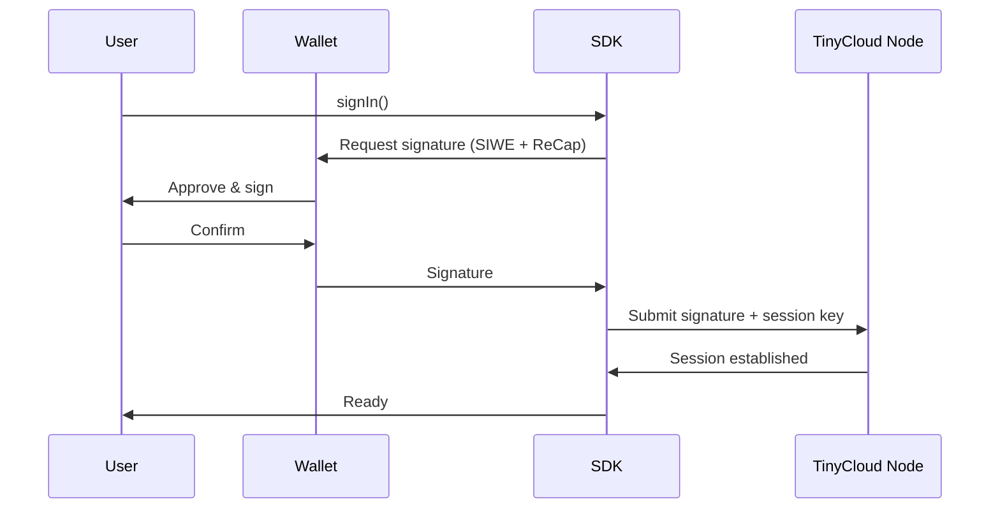

TinyCloud uses Sign-In with Ethereum (SIWE) for authentication. Users prove wallet ownership to establish sessions that authorize access to their space.

## How SIWE Works

The authentication flow follows three steps regardless of which SDK you use:

<Steps>
<Step title="Connect wallet">
  The user connects their Ethereum wallet. In the browser, this triggers a popup (MetaMask, WalletConnect, etc.). In Node.js, the SDK derives the address from the provided private key.
</Step>
<Step title="Sign SIWE message">
  The SDK constructs a SIWE message containing the domain, address, chain ID, and requested capabilities (via ReCap). The user (or private key) signs this message to prove ownership.
</Step>
<Step title="Session established">
  TinyCloud verifies the signature, creates the user's space if needed, and issues a session. The session key can perform operations on behalf of the user until it expires.
</Step>
</Steps>



## Web SDK Sign-In

Calling `signIn()` in the browser triggers the wallet popup for the user to approve.

<Tabs>
<Tab title="Quick">
```typescript
import { TinyCloudWeb } from '@tinycloudlabs/web-sdk';

const tc = new TinyCloudWeb({
  notifications: { popups: true },
  persistence: { autoResumeSession: true },
});

await tc.signIn();
console.log('Signed in:', tc.userAuthorization.getSpaceId());
```
</Tab>
<Tab title="Explained">
```typescript
import { TinyCloudWeb } from '@tinycloudlabs/web-sdk';

// Create an instance with full configuration
const tc = new TinyCloudWeb({
  // TinyCloud node(s) to connect to
  tinycloudHosts: ['https://node.tinycloud.xyz'],

  // Prefix for space isolation (different prefixes = different spaces)
  spacePrefix: 'my-app',

  // Automatically create the space on first sign-in
  autoCreateSpace: true,

  // Prefix for all KV keys (optional, for further key isolation)
  kvPrefix: '',

  // Show popup notifications for sign-in events
  notifications: { popups: true },

  // Automatically resume sessions on page reload
  persistence: { autoResumeSession: true },
});

// Triggers the wallet popup:
// 1. Wallet connection prompt (select account)
// 2. SIWE message signature prompt
const session = await tc.signIn();
console.log('Signed in as:', session.address);
```
</Tab>
</Tabs>

### Web SDK Configuration Reference

| Option | Type | Default | Description |
|--------|------|---------|-------------|
| `tinycloudHosts` | `string[]` | `['https://node.tinycloud.xyz']` | TinyCloud node endpoints |
| `spacePrefix` | `string` | `''` | Prefix for space ID derivation |
| `autoCreateSpace` | `boolean` | `true` | Create space on first sign-in |
| `kvPrefix` | `string` | `''` | Prefix prepended to all KV keys |

## Node SDK Sign-In

The Node SDK signs the SIWE message automatically using the provided private key -- no user interaction required.

<Tabs>
<Tab title="Quick">
```typescript
import { TinyCloudNode } from '@tinycloudlabs/node-sdk';

const tc = new TinyCloudNode({
  privateKey: process.env.WALLET_PRIVATE_KEY,
  host: 'https://node.tinycloud.xyz',
  prefix: 'my-app',
});

await tc.signIn();
console.log('Signed in:', tc.spaceId);
```
</Tab>
<Tab title="Explained">
```typescript
import { TinyCloudNode } from '@tinycloudlabs/node-sdk';

const tc = new TinyCloudNode({
  // Ethereum private key (32-byte hex string)
  privateKey: process.env.WALLET_PRIVATE_KEY,

  // TinyCloud node to connect to
  host: 'https://node.tinycloud.xyz',

  // Prefix for space isolation
  prefix: 'my-app',

  // Automatically create the space on first sign-in
  autoCreateSpace: true,

  // Session duration in milliseconds (default: 24 hours)
  sessionExpirationMs: 24 * 60 * 60 * 1000,
});

// Signs the SIWE message automatically with the private key
// No wallet popup -- happens instantly
await tc.signIn();
console.log('Signed in:', tc.spaceId);
```
</Tab>
</Tabs>

### Node SDK Configuration Reference

| Option | Type | Default | Description |
|--------|------|---------|-------------|
| `privateKey` | `string` | - | Ethereum private key (hex). Omit for session-only mode. |
| `host` | `string` | `'https://node.tinycloud.xyz'` | TinyCloud node endpoint |
| `prefix` | `string` | `''` | Prefix for space ID derivation |
| `autoCreateSpace` | `boolean` | `true` | Create space on first sign-in |
| `sessionExpirationMs` | `number` | `86400000` (24h) | Session TTL in milliseconds |

<Warning>
Never hardcode private keys in source code. Always use environment variables or a secrets manager.
</Warning>

## Session-Only Mode (Node SDK)

You can create a `TinyCloudNode` instance **without** a private key. This creates a session-only client that cannot sign in on its own but can receive delegations from other users.

```typescript
import { TinyCloudNode } from '@tinycloudlabs/node-sdk';

// No privateKey -- session-only mode
const tc = new TinyCloudNode({
  host: 'https://node.tinycloud.xyz',
});

// tc.signIn() would fail -- no private key to sign with

// But this client can receive and use delegations
const access = await tc.useDelegation(portableDelegation);
const data = await access.kv.get('shared/document');
```

<Tip>
Session-only mode is useful for services that only need to read delegated data, such as a read-only dashboard or a webhook consumer.
</Tip>

## Session Persistence

Sessions can be persisted so users do not need to re-authenticate on every page reload or process restart.

<Tabs>
<Tab title="Web SDK">
The Web SDK supports three storage backends:

```typescript
const tc = new TinyCloudWeb({
  persistence: {
    autoResumeSession: true,
  },
  sessionConfig: {
    // 'localStorage' - persists across tabs and browser sessions
    // 'sessionStorage' - clears when the tab closes
    // 'memory' - clears on page reload (default)
    storageType: 'localStorage',
  },
});

// On subsequent page loads, the session is automatically restored
// if autoResumeSession is true and a valid session exists
```

You can also manually check for an existing session:

```typescript
const resumed = await tc.tryResumeSession();

if (resumed) {
  console.log('Session restored');
} else {
  await tc.signIn(); // Fresh sign-in required
}
```
</Tab>
<Tab title="Node SDK">
The Node SDK provides two session storage implementations:

<CodeGroup>
```typescript FileSessionStorage
import { TinyCloudNode, FileSessionStorage } from '@tinycloudlabs/node-sdk';

// Persists session to disk -- survives process restarts
const tc = new TinyCloudNode({
  privateKey: process.env.WALLET_PRIVATE_KEY,
  sessionStorage: new FileSessionStorage('./session.json'),
});

await tc.signIn();
// Session saved to ./session.json

// On next startup, signIn() reuses the persisted session if still valid
```

```typescript MemorySessionStorage
import { TinyCloudNode, MemorySessionStorage } from '@tinycloudlabs/node-sdk';

// Session lives only in memory -- lost on process exit
const tc = new TinyCloudNode({
  privateKey: process.env.WALLET_PRIVATE_KEY,
  sessionStorage: new MemorySessionStorage(),
});

await tc.signIn();
// Session gone when process exits
```
</CodeGroup>

<Note>
`FileSessionStorage` is recommended for production services. `MemorySessionStorage` is the default if no storage is specified.
</Note>
</Tab>
</Tabs>

## Session Expiry

Sessions have a limited lifetime. When a session expires, operations will fail and the user must re-authenticate.

<CodeGroup>
```typescript Web SDK
// Configure expiry duration
const tc = new TinyCloudWeb({
  sessionConfig: {
    storageType: 'localStorage',
    expirationTime: '24h', // Session duration
  },
});

// Check if the current session is still valid
if (tc.isSessionExpired()) {
  await tc.signIn(); // Re-authenticate
}
```

```typescript Node SDK
// Configure expiry via sessionExpirationMs
const tc = new TinyCloudNode({
  privateKey: process.env.WALLET_PRIVATE_KEY,
  sessionExpirationMs: 24 * 60 * 60 * 1000, // 24 hours
});

// If the session expires mid-operation, catch the error
try {
  await tc.kv.get('key');
} catch (error) {
  if (error.code === 'SESSION_EXPIRED') {
    await tc.signIn(); // Re-authenticate
  }
}
```
</CodeGroup>

<Tip>
For long-running Node.js services, use `FileSessionStorage` combined with a try/catch around operations to automatically re-authenticate when the session expires.
</Tip>

## Sign Out

Clear the current session and remove persisted credentials.

<CodeGroup>
```typescript Web SDK
await tc.signOut();
// Session cleared from localStorage/sessionStorage/memory
```

```typescript Node SDK
await tc.signOut();
// Session removed from storage (file or memory)
```
</CodeGroup>

<Warning>
After signing out, all operations will fail until a new `signIn()` is completed. Persisted sessions are deleted permanently.
</Warning>

## Node SDK Sign Strategies

The Node SDK supports multiple strategies for how the SIWE message is signed, giving you control over the approval flow.

<Tabs>
<Tab title="Auto-sign (default)">
Signs immediately using the provided private key. Best for automated services.

```typescript
const tc = new TinyCloudNode({
  privateKey: process.env.WALLET_PRIVATE_KEY,
  // signStrategy defaults to 'auto'
});

await tc.signIn(); // Signs instantly, no interaction
```
</Tab>

<Tab title="Callback">
Provide a callback to intercept and approve sign requests. Useful for custom approval flows or logging.

```typescript
const tc = new TinyCloudNode({
  privateKey: process.env.WALLET_PRIVATE_KEY,
  signStrategy: 'callback',
  onSignRequest: async (message) => {
    console.log('Signing SIWE message:', message);
    // Custom logic: check rate limits, log audit trail, etc.
    return true; // Return true to proceed, false to reject
  },
});

await tc.signIn();
```
</Tab>

<Tab title="Event Emitter">
Use events for fully decoupled signing workflows. Useful for multi-step approval pipelines.

```typescript
const tc = new TinyCloudNode({
  privateKey: process.env.WALLET_PRIVATE_KEY,
  signStrategy: 'event-emitter',
});

tc.on('signRequest', async (message, approve) => {
  console.log('Sign request received:', message);
  // Perform async checks, user confirmation, etc.
  approve(); // Call to proceed with signing
});

await tc.signIn();
```
</Tab>
</Tabs>

## Complete Example

A full authentication flow with session persistence and expiry handling:

<CodeGroup>
```typescript Web SDK
import { TinyCloudWeb } from '@tinycloudlabs/web-sdk';

const tc = new TinyCloudWeb({
  tinycloudHosts: ['https://node.tinycloud.xyz'],
  spacePrefix: 'my-app',
  autoCreateSpace: true,
  notifications: { popups: true },
  persistence: { autoResumeSession: true },
  sessionConfig: { storageType: 'localStorage' },
});

async function ensureAuthenticated() {
  // Try to resume an existing session first
  const resumed = await tc.tryResumeSession();

  if (!resumed || tc.isSessionExpired()) {
    // No valid session -- trigger wallet sign-in
    await tc.signIn();
  }

  console.log('Space:', tc.userAuthorization.getSpaceId());
}

async function handleSignOut() {
  await tc.signOut();
  console.log('Signed out');
}
```

```typescript Node SDK
import { TinyCloudNode, FileSessionStorage } from '@tinycloudlabs/node-sdk';

const tc = new TinyCloudNode({
  privateKey: process.env.WALLET_PRIVATE_KEY,
  host: 'https://node.tinycloud.xyz',
  prefix: 'my-app',
  autoCreateSpace: true,
  sessionExpirationMs: 24 * 60 * 60 * 1000,
  sessionStorage: new FileSessionStorage('./session.json'),
});

async function ensureAuthenticated() {
  const resumed = await tc.tryResumeSession();

  if (!resumed) {
    await tc.signIn();
  }

  console.log('Space:', tc.spaceId);
}

async function handleSignOut() {
  await tc.signOut();
  console.log('Signed out');
}
```
</CodeGroup>
