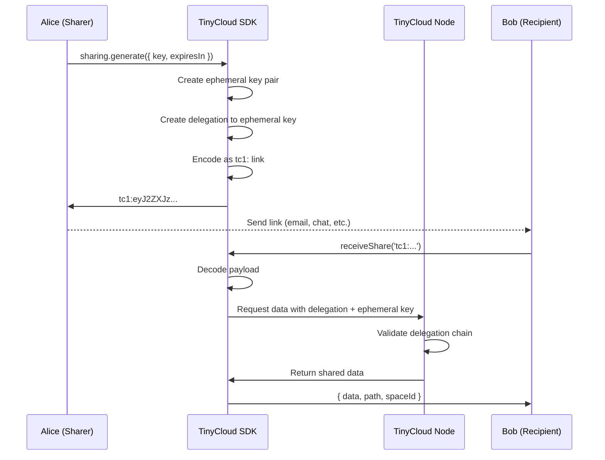

Sharing links let you create self-contained, expiring URLs that give recipients access to specific data in your space -- without requiring them to authenticate or have a TinyCloud account.

## What Are Sharing Links?

A TinyCloud sharing link is a compact string with the `tc1:` prefix that embeds everything needed to access shared data:

```
tc1:eyJ2ZXJzaW9uIjoxLCJrZXkiOiJteS1kb2N1bWVudCIsImRlbGVnYX...
```

Under the hood, this string is a base64url-encoded JSON payload containing:

- **version**: Link format version
- **key**: The KV path that was shared
- **delegation**: A signed UCAN delegation granting read access
- **spaceId**: The owner's space where the data lives
- **host**: The TinyCloud node to contact
- **embedded private key**: A session key for the recipient to authenticate the request

<Warning>
Sharing links contain an embedded private key that grants access to the shared data. Treat them like passwords. Anyone who has the link can read the shared data until the link expires.
</Warning>

## Generating Share Links

### Web SDK

```typescript
import { TinyCloudWeb } from '@tinycloud/web-sdk';

const tc = new TinyCloudWeb({
  host: 'https://node.tinycloud.xyz',
  prefix: 'my-app',
});

await tc.signIn();

// Generate a sharing link for a specific key
const result = await tc.sharing.generate({
  path: 'my-document',
  expiry: new Date(Date.now() + 7 * 24 * 60 * 60 * 1000),
});

if (result.ok) {
  console.log(result.data);
  // tc1:eyJ2ZXJz...
}
```

### Node SDK

```typescript
import { TinyCloudNode } from '@tinycloud/node-sdk';

const tc = new TinyCloudNode({
  host: 'https://node.tinycloud.xyz',
  prefix: 'my-app',
  privateKey: process.env.WALLET_PRIVATE_KEY,
});

await tc.signIn();

// Generate a sharing link
const result = await tc.sharing.generate({
  path: 'reports/q4-summary',
  expiry: new Date(Date.now() + 24 * 60 * 60 * 1000),
});
```

### Generation Options

<Tabs>
<Tab title="Quick">
```typescript
// Simple: share a key for 7 days
const result = await tc.sharing.generate({
  path: 'my-document',
  expiry: new Date(Date.now() + 7 * 24 * 60 * 60 * 1000),
});
```
</Tab>

<Tab title="Explained">
```typescript
const result = await tc.sharing.generate({
  // The KV path to share
  // The recipient will be able to read the data at this path
  path: 'my-document',

  // When the link expires (absolute Date)
  // The embedded delegation expires at this time
  expiry: new Date(Date.now() + 7 * 24 * 60 * 60 * 1000),
});

if (result.ok) {
  console.log(result.data); // The tc1:... link
}
```
</Tab>
</Tabs>

## Receiving Share Links

Recipients can access shared data using the static `receiveShare` method. This does not require the recipient to have a TinyCloud account or an active session.

### Web SDK

```typescript
import { TinyCloudWeb } from '@tinycloud/web-sdk';

const result = await TinyCloudWeb.receiveShare('tc1:eyJ2ZXJz...');

if (result.ok) {
  console.log(result.data.data);    // The shared data (parsed value)
  console.log(result.data.path);    // Path that was shared, e.g. "my-document"
  console.log(result.data.spaceId); // Owner's space ID
} else {
  console.error('Failed to receive share:', result.error);
}
```

### Node SDK

```typescript
import { TinyCloudNode } from '@tinycloud/node-sdk';

const result = await TinyCloudNode.receiveShare('tc1:eyJ2ZXJz...');

if (result.ok) {
  console.log(result.data.data);    // The shared data
  console.log(result.data.path);    // Shared path
  console.log(result.data.spaceId); // Owner's space ID
}
```

<Note>
`receiveShare` is a **static** method. You do not need to create a TinyCloud instance or call `signIn()` to use it. The link contains all the credentials needed to fetch the data.
</Note>

## How It Works Internally

When you generate a sharing link, the SDK:

1. Creates a new ephemeral session key pair
2. Creates a delegation from your identity to the ephemeral key, scoped to the specified path with read-only access
3. Packages the key path, delegation, space ID, host, and the ephemeral private key into a JSON payload
4. Encodes the payload as base64url with the `tc1:` prefix

When a recipient opens the link:

1. The SDK decodes the `tc1:` payload
2. Uses the embedded private key to authenticate as the ephemeral session
3. Presents the embedded delegation to the TinyCloud node
4. The node validates the delegation chain and returns the data



## Link Format Details

The `tc1:` prefix identifies a TinyCloud v1 sharing link. The payload after the prefix is base64url-encoded JSON with this structure:

```json
{
  "version": 1,
  "key": "my-document",
  "delegation": "<signed UCAN delegation>",
  "spaceId": "0x1234...abcd-1-my-app",
  "host": "https://node.tinycloud.xyz",
  "sessionKey": "<ephemeral private key>"
}
```

| Field | Description |
|-------|-------------|
| `version` | Link format version (currently `1`) |
| `key` | The KV path being shared |
| `delegation` | Signed UCAN granting the ephemeral key read access |
| `spaceId` | The sharer's space ID |
| `host` | TinyCloud node URL to contact |
| `sessionKey` | Ephemeral private key for authentication |

## Security Considerations

<AccordionGroup>
  <Accordion title="Links are bearer tokens">
    Anyone who has the link can access the shared data. Do not post sharing links publicly unless you intend for the data to be publicly readable. Use secure channels (direct messages, encrypted email) to distribute links containing sensitive data.
  </Accordion>

  <Accordion title="Expiry is enforced server-side">
    The delegation embedded in the link has a cryptographically signed expiry. The TinyCloud node rejects requests with expired delegations. There is no way to extend the expiry of an existing link -- you must generate a new one.
  </Accordion>

  <Accordion title="Links are read-only">
    Generated sharing links only grant read access to the specified key. Recipients cannot modify or delete the shared data through the link.
  </Accordion>

  <Accordion title="Links are scoped to a single key">
    Each link grants access to exactly one KV path. To share multiple keys, generate separate links for each one.
  </Accordion>
</AccordionGroup>

## Expiry Handling

Sharing links respect the delegation expiry set at generation time. Once expired, the link stops working permanently.

```typescript
// Short-lived link for sensitive data
const sensitiveResult = await tc.sharing.generate({
  path: 'credentials/api-key',
  expiry: new Date(Date.now() + 60 * 60 * 1000), // 1 hour
});

// Long-lived link for public content
const publicResult = await tc.sharing.generate({
  path: 'blog/latest-post',
  expiry: new Date(Date.now() + 30 * 24 * 60 * 60 * 1000), // 30 days
});
```

<Tip>
Choose expiry durations based on the sensitivity of the data and the use case. For one-time sharing, use short durations like `'1h'`. For persistent links embedded in documentation or wikis, use longer durations like `'30d'`.
</Tip>

## Complete Example

Alice shares a document with Bob via a link, and Bob reads it without needing a TinyCloud account.

<Steps>
<Step title="Alice stores data and generates a link">
```typescript
import { TinyCloudNode } from '@tinycloud/node-sdk';

const alice = new TinyCloudNode({
  host: 'https://node.tinycloud.xyz',
  prefix: 'my-app',
  privateKey: process.env.ALICE_PRIVATE_KEY,
});

await alice.signIn();

// Store the document
await alice.kv.put('docs/meeting-notes', {
  title: 'Q4 Planning',
  content: 'We decided to...',
  date: '2026-01-15',
});

// Generate a sharing link (valid for 7 days)
const result = await alice.sharing.generate({
  path: 'docs/meeting-notes',
  expiry: new Date(Date.now() + 7 * 24 * 60 * 60 * 1000),
});

if (result.ok) {
  console.log('Share this link:', result.data);
  // tc1:eyJ2ZXJz...
}
```
</Step>

<Step title="Alice sends the link to Bob">
Alice sends the `tc1:...` link to Bob through any channel -- email, chat, or even a QR code.
</Step>

<Step title="Bob receives the shared data">
```typescript
import { TinyCloudNode } from '@tinycloud/node-sdk';

// Bob does NOT need to signIn or have a private key
const result = await TinyCloudNode.receiveShare(link);

if (result.ok) {
  console.log(result.data.data);
  // { title: 'Q4 Planning', content: 'We decided to...', date: '2026-01-15' }

  console.log(result.data.path);
  // 'docs/meeting-notes'

  console.log(result.data.spaceId);
  // '0xAlice...address-1-my-app'
} else {
  console.error('Share failed:', result.error);
  // Possible reasons: link expired, data deleted, node unreachable
}
```
</Step>
</Steps>
