OpenKey is a Trusted Execution Environment (TEE) based key management service built by TinyCloud Labs. It generates, stores, and signs with Ethereum private keys entirely inside a hardware-isolated enclave, so keys never exist in plaintext outside the TEE. Users authenticate with passkeys (WebAuthn), making the experience passwordless and phishing-resistant.

OpenKey also functions as an OAuth 2.1 provider, allowing third-party applications to request signing operations on behalf of users. An embeddable widget and client SDK let any web application offer a "Sign with OpenKey" flow without requiring browser extensions or seed phrases.

## Key Features

<CardGroup cols={2}>
  <Card title="TEE Key Generation" icon="microchip">
    Private keys are generated and sealed inside a Trusted Execution Environment. They never leave the enclave in plaintext.
  </Card>
  <Card title="Passkey Authentication" icon="fingerprint">
    Passwordless, phishing-resistant login using WebAuthn. No seed phrases to lose.
  </Card>
  <Card title="Message Signing" icon="signature">
    Sign arbitrary messages and EIP-712 typed data. Supports both `personal_sign` and raw formats.
  </Card>
  <Card title="OAuth 2.1 Provider" icon="lock">
    Third-party apps authenticate users and request signing through a standard OAuth flow with PKCE.
  </Card>
  <Card title="Embeddable Widget" icon="window-maximize">
    Drop-in popup or iframe widget for connect and sign flows. No browser extension required.
  </Card>
  <Card title="TinyCloud Integration" icon="cloud">
    Use OpenKey as the signer for TinyCloud Web SDK, replacing MetaMask or other wallet extensions.
  </Card>
</CardGroup>

## Architecture

```mermaid
graph TB
    subgraph Client["Client (Browser)"]
        App[Your Application]
        SDK["@openkey/sdk"]
        Widget[OpenKey Widget]
    end

    subgraph TEE["Trusted Execution Environment (dstack)"]
        API["Hono API Server"]
        Auth[better-auth]
        KMS[TEE Key Derivation]
        Seal[Seal / Unseal]
    end

    DB[(PostgreSQL)]

    App -->|postMessage| Widget
    App -->|OAuth / SDK| SDK
    SDK -->|HTTPS| API
    Widget -->|HTTPS| API
    API --> Auth
    API --> Seal
    Seal --> KMS
    API --> DB

    style TEE fill:#1a2b1a,stroke:#16a34a
    style Client fill:#1a1a2b,stroke:#3b82f6
```

### How It Works

<Steps>
<Step title="User registers with email or Google">
  The user verifies their identity via email OTP or Google OAuth. This creates their account.
</Step>
<Step title="Passkey is created">
  During registration, the user registers a WebAuthn passkey (biometric or hardware key). All future logins use this passkey.
</Step>
<Step title="First key is auto-generated">
  When the account is created, an Ethereum private key is generated inside the TEE and sealed with a TEE-derived encryption key. The sealed blob is stored in the database.
</Step>
<Step title="Signing happens inside the TEE">
  When a sign request arrives, the API unseals the private key in memory, signs the message, and returns the signature. The plaintext key exists only in TEE memory during signing.
</Step>
</Steps>

## How OpenKey Relates to TinyCloud

TinyCloud uses Sign-In with Ethereum (SIWE) for authentication, which traditionally requires a browser wallet extension like MetaMask. OpenKey provides an alternative: users get an Ethereum key managed by OpenKey and authenticate to TinyCloud without installing any extension. This lowers the barrier to entry for non-crypto-native users while preserving the same cryptographic guarantees.

See [TinyCloud Integration](/openkey/tinycloud-integration) for setup details.

## Next Steps

<CardGroup cols={2}>
  <Card title="Quickstart" icon="rocket" href="/openkey/quickstart">
    Create an account, generate a key, and sign your first message.
  </Card>
  <Card title="Widget Integration" icon="window-maximize" href="/openkey/widget">
    Embed OpenKey connect and sign flows in your application.
  </Card>
  <Card title="OAuth Provider" icon="lock" href="/openkey/oauth">
    Use OpenKey as an OAuth 2.1 provider for your app.
  </Card>
  <Card title="TinyCloud Integration" icon="cloud" href="/openkey/tinycloud-integration">
    Use OpenKey as the wallet provider for TinyCloud SDK.
  </Card>
</CardGroup>
