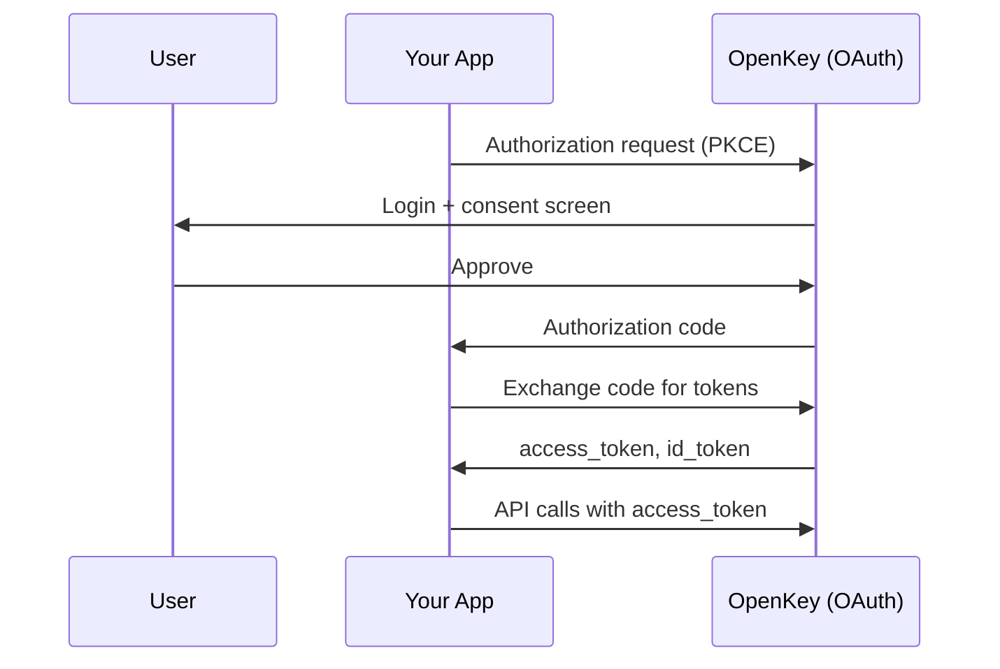

OpenKey implements an OAuth 2.1 provider, allowing your application to authenticate users with their OpenKey account and request signing operations using standard OAuth flows. This is the recommended integration path for server-side applications or apps that need token-based access.

## How It Works



OpenKey uses OAuth 2.1 with PKCE (Proof Key for Code Exchange), which is secure for both server-side and single-page applications without requiring a client secret for public clients.

## Register an OAuth Client

Before using OAuth, you need to register your application as an OAuth client. Client registration is done through the admin API.

<Warning>
Client registration requires an admin API key. Contact your OpenKey administrator or use the CLI tool if you are self-hosting.
</Warning>

```bash
curl -X POST https://api.openkey.so/api/admin/oauth/clients \
  -H "Content-Type: application/json" \
  -H "Authorization: Bearer YOUR_ADMIN_API_KEY" \
  -d '{
    "name": "My Application",
    "redirectUris": ["https://myapp.com/callback"],
    "uri": "https://myapp.com",
    "type": "web"
  }'
```

Response:

```json
{
  "success": true,
  "client": {
    "id": "abc123",
    "clientId": "ok_1a2b3c4d5e6f7g8h9i0j...",
    "clientSecret": "oks_9z8y7x6w5v4u3t2s1r0q...",
    "name": "My Application",
    "redirectUris": ["https://myapp.com/callback"],
    "uri": "https://myapp.com",
    "type": "web",
    "public": false,
    "createdAt": "2026-01-15T10:30:00.000Z"
  }
}
```

<Note>
The `clientSecret` is only returned once at creation time. Store it securely. For SPA or native apps, use `type: "spa"` or `type: "native"` to create a public client that does not require a secret.
</Note>

### Client Types

| Type | `clientSecret` | `tokenEndpointAuthMethod` | Use Case |
|------|---------------|---------------------------|----------|
| `web` | Yes (confidential) | `client_secret_basic` | Server-side web apps |
| `spa` | No (public) | `none` | Single-page applications |
| `native` | No (public) | `none` | Mobile or desktop apps |

## Authorization Code Flow

<Steps>
<Step title="Build the authorization URL">
  Redirect the user to OpenKey's authorization endpoint with PKCE parameters.

  ```typescript
  // PKCE helpers
  function generateCodeVerifier(): string {
    const array = new Uint8Array(32);
    crypto.getRandomValues(array);
    return Array.from(array, b => b.toString(16).padStart(2, '0')).join('');
  }

  async function generateCodeChallenge(verifier: string): Promise<string> {
    const data = new TextEncoder().encode(verifier);
    const hash = await crypto.subtle.digest('SHA-256', data);
    return btoa(String.fromCharCode(...new Uint8Array(hash)))
      .replace(/\+/g, '-').replace(/\//g, '_').replace(/=+$/, '');
  }

  function generateRandomString(length: number): string {
    const array = new Uint8Array(length);
    crypto.getRandomValues(array);
    return Array.from(array, b => b.toString(16).padStart(2, '0')).join('').slice(0, length);
  }

  // Generate PKCE values
  const codeVerifier = generateCodeVerifier();
  const codeChallenge = await generateCodeChallenge(codeVerifier);
  const state = generateRandomString(16);

  // Store verifier and state for later
  sessionStorage.setItem('pkce_verifier', codeVerifier);
  sessionStorage.setItem('oauth_state', state);

  // Build authorization URL
  const authUrl = new URL('https://api.openkey.so/api/auth/oauth2/authorize');
  authUrl.searchParams.set('client_id', 'ok_your_client_id');
  authUrl.searchParams.set('redirect_uri', 'https://myapp.com/callback');
  authUrl.searchParams.set('response_type', 'code');
  authUrl.searchParams.set('scope', 'openid');
  authUrl.searchParams.set('state', state);
  authUrl.searchParams.set('code_challenge', codeChallenge);
  authUrl.searchParams.set('code_challenge_method', 'S256');

  // Redirect to OpenKey
  window.location.href = authUrl.toString();
  ```
</Step>

<Step title="User authenticates and consents">
  OpenKey redirects the user to its login page. The user authenticates with their passkey and is shown a consent screen for your application. After approval, OpenKey redirects back to your `redirect_uri` with an authorization code.

  ```
  https://myapp.com/callback?code=AUTH_CODE&state=ORIGINAL_STATE
  ```
</Step>

<Step title="Verify state and exchange the code">
  Verify the `state` parameter matches what you sent, then exchange the authorization code for tokens.

  ```typescript
  // Verify state
  const params = new URLSearchParams(window.location.search);
  const returnedState = params.get('state');
  const savedState = sessionStorage.getItem('oauth_state');

  if (returnedState !== savedState) {
    throw new Error('State mismatch - possible CSRF attack');
  }

  // Exchange code for tokens
  const response = await fetch('https://api.openkey.so/api/auth/oauth2/token', {
    method: 'POST',
    headers: { 'Content-Type': 'application/x-www-form-urlencoded' },
    body: new URLSearchParams({
      grant_type: 'authorization_code',
      code: params.get('code'),
      redirect_uri: 'https://myapp.com/callback',
      client_id: 'ok_your_client_id',
      code_verifier: sessionStorage.getItem('pkce_verifier'),
    }),
  });

  const tokens = await response.json();
  ```
</Step>

<Step title="Use the tokens">
  The token response contains:

  ```json
  {
    "access_token": "eyJhbG...",
    "token_type": "Bearer",
    "expires_in": 3600,
    "id_token": "eyJhbG...",
    "scope": "openid",
    "refresh_token": "rt_abc123..."
  }
  ```
</Step>
</Steps>

### Token Lifetimes

| Token | Lifetime |
|-------|----------|
| Access token | 1 hour |
| ID token | 1 hour |
| Refresh token | 7 days |

## Using the SDK

The OpenKey SDK provides helper methods that handle PKCE generation, state management, and token exchange automatically.

```typescript
import { OpenKey } from '@openkey/sdk';

const openkey = new OpenKey({ appName: 'My App' });

// Start OAuth flow (opens popup)
const { code, state } = await openkey.oauth.connect({
  clientId: 'ok_your_client_id',
  redirectUri: 'https://myapp.com/callback',
});

// Exchange code for tokens
const tokens = await openkey.oauth.exchangeCode(code, {
  clientId: 'ok_your_client_id',
  redirectUri: 'https://myapp.com/callback',
});

console.log('Access token:', tokens.access_token);
```

### Handling the Callback

If using redirect mode instead of popup, parse the callback URL on your callback page:

```typescript
const openkey = new OpenKey();

// Parse the callback URL
const result = openkey.oauth.parseCallback();

if ('error' in result) {
  console.error('OAuth error:', result.error, result.errorDescription);
} else {
  // Verify state
  if (!openkey.oauth.verifyState(result.state)) {
    throw new Error('State mismatch');
  }

  // Exchange code
  const tokens = await openkey.oauth.exchangeCode(result.code, {
    clientId: 'ok_your_client_id',
    redirectUri: 'https://myapp.com/callback',
  });
}
```

## Scopes

Currently, OpenKey supports the following OAuth scope:

| Scope | Description |
|-------|-------------|
| `openid` | Basic identity verification. Returns user info in the ID token. |

<Note>
Additional scopes for granular signing permissions are planned for future releases.
</Note>

## Managing OAuth Clients

### List Clients

```bash
curl https://api.openkey.so/api/admin/oauth/clients \
  -H "Authorization: Bearer YOUR_ADMIN_API_KEY"
```

### Update a Client

```bash
curl -X PATCH https://api.openkey.so/api/admin/oauth/clients/ok_client_id \
  -H "Content-Type: application/json" \
  -H "Authorization: Bearer YOUR_ADMIN_API_KEY" \
  -d '{
    "name": "Updated App Name",
    "redirectUris": ["https://myapp.com/callback", "https://staging.myapp.com/callback"]
  }'
```

### Disable a Client

```bash
curl -X PATCH https://api.openkey.so/api/admin/oauth/clients/ok_client_id \
  -H "Content-Type: application/json" \
  -H "Authorization: Bearer YOUR_ADMIN_API_KEY" \
  -d '{"disabled": true}'
```

### Delete a Client

```bash
curl -X DELETE https://api.openkey.so/api/admin/oauth/clients/ok_client_id \
  -H "Authorization: Bearer YOUR_ADMIN_API_KEY"
```

## Server-Side Example

Here is a complete server-side example using Node.js and Express:

```typescript
import express from 'express';
import crypto from 'crypto';

const app = express();
const CLIENT_ID = 'ok_your_client_id';
const CLIENT_SECRET = 'oks_your_client_secret';
const REDIRECT_URI = 'https://myapp.com/callback';

// Store PKCE verifiers in session (use a real session store in production)
const sessions = new Map();

app.get('/login', (req, res) => {
  const state = crypto.randomBytes(16).toString('hex');
  const verifier = crypto.randomBytes(32).toString('base64url');
  const challenge = crypto
    .createHash('sha256')
    .update(verifier)
    .digest('base64url');

  sessions.set(state, { verifier });

  const authUrl = new URL('https://api.openkey.so/api/auth/oauth2/authorize');
  authUrl.searchParams.set('client_id', CLIENT_ID);
  authUrl.searchParams.set('redirect_uri', REDIRECT_URI);
  authUrl.searchParams.set('response_type', 'code');
  authUrl.searchParams.set('scope', 'openid');
  authUrl.searchParams.set('state', state);
  authUrl.searchParams.set('code_challenge', challenge);
  authUrl.searchParams.set('code_challenge_method', 'S256');

  res.redirect(authUrl.toString());
});

app.get('/callback', async (req, res) => {
  const { code, state } = req.query;
  const session = sessions.get(state);

  if (!session) {
    return res.status(400).send('Invalid state');
  }

  sessions.delete(state);

  const tokenRes = await fetch('https://api.openkey.so/api/auth/oauth2/token', {
    method: 'POST',
    headers: { 'Content-Type': 'application/x-www-form-urlencoded' },
    body: new URLSearchParams({
      grant_type: 'authorization_code',
      code,
      redirect_uri: REDIRECT_URI,
      client_id: CLIENT_ID,
      code_verifier: session.verifier,
    }),
  });

  const tokens = await tokenRes.json();
  res.json({ message: 'Authenticated!', tokens });
});

app.listen(3000);
```

## Next Steps

<CardGroup cols={2}>
  <Card title="Widget Integration" icon="window-maximize" href="/openkey/widget">
    Use the widget for a lighter client-side integration.
  </Card>
  <Card title="TinyCloud Integration" icon="cloud" href="/openkey/tinycloud-integration">
    Combine OpenKey OAuth with TinyCloud SDK.
  </Card>
</CardGroup>
