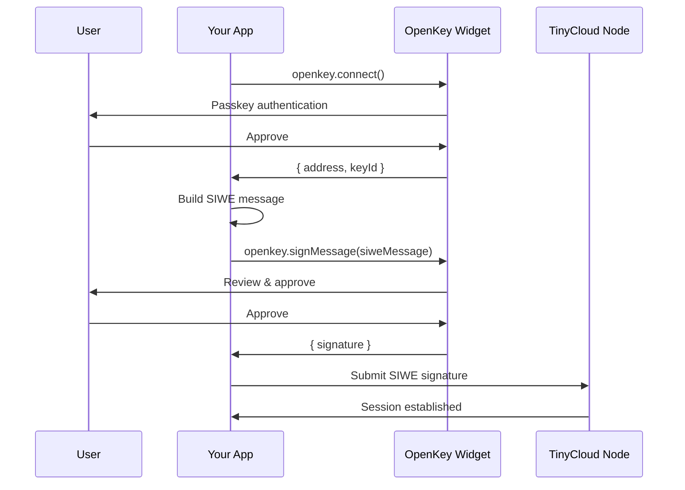

OpenKey can replace browser wallet extensions (MetaMask, WalletConnect, etc.) as the signer for TinyCloud Web SDK. This means users can authenticate to TinyCloud using their OpenKey-managed Ethereum keys, with passkey-based login instead of a browser extension.

## Why Use OpenKey with TinyCloud

- **No browser extension required**: Users do not need MetaMask or any wallet installed
- **Passkey-based authentication**: Biometric or hardware key login instead of seed phrases
- **TEE key security**: Private keys are sealed inside a hardware enclave
- **Lower onboarding friction**: Non-crypto-native users can get started without understanding wallets
- **Same cryptographic guarantees**: OpenKey produces standard Ethereum signatures that TinyCloud verifies the same way as any wallet

## Architecture



Instead of the wallet extension signing the SIWE message, OpenKey's TEE-managed key signs it. From TinyCloud's perspective, the signature is indistinguishable from one produced by MetaMask.

## Setup

<Steps>
<Step title="Install dependencies">

```bash
npm install @tinycloudlabs/web-sdk @openkey/sdk
```
</Step>

<Step title="Initialize OpenKey and TinyCloud">

```typescript
import { OpenKey } from '@openkey/sdk';
import { TinyCloudWeb } from '@tinycloudlabs/web-sdk';

const openkey = new OpenKey({
  appName: 'My TinyCloud App',
});

const tc = new TinyCloudWeb({
  notifications: { popups: true },
  persistence: { autoResumeSession: true },
});
```
</Step>

<Step title="Connect with OpenKey">

Use OpenKey to get the user's Ethereum address and key ID before signing in to TinyCloud.

```typescript
// Connect with OpenKey (passkey auth + key selection)
const { address, keyId } = await openkey.connect();
console.log('OpenKey address:', address);
```
</Step>

<Step title="Sign the SIWE message with OpenKey">

Provide a custom signer to TinyCloud that delegates signing to OpenKey instead of a browser wallet.

```typescript
// Sign in to TinyCloud using OpenKey as the signer
const session = await tc.signIn({
  // Custom signer that uses OpenKey
  signer: {
    getAddress: async () => address,
    signMessage: async (message: string) => {
      const { signature } = await openkey.signMessage({
        message,
        keyId,
      });
      return signature;
    },
  },
});

console.log('TinyCloud session:', session.address);
```
</Step>

<Step title="Use TinyCloud normally">

Once signed in, all TinyCloud operations work exactly the same as with a browser wallet.

```typescript
// Store data in the user's space
await tc.storage.put('profile', {
  name: 'Alice',
  wallet: 'openkey',
});

// Retrieve data
const profile = await tc.storage.get('profile');
console.log(profile);
```
</Step>
</Steps>

## Complete Example

<CodeGroup>
```typescript Vanilla JS
import { OpenKey } from '@openkey/sdk';
import { TinyCloudWeb } from '@tinycloudlabs/web-sdk';

async function main() {
  const openkey = new OpenKey({ appName: 'My App' });
  const tc = new TinyCloudWeb({
    notifications: { popups: true },
    persistence: { autoResumeSession: true },
  });

  // Step 1: Connect with OpenKey
  const { address, keyId } = await openkey.connect();
  console.log('Connected via OpenKey:', address);

  // Step 2: Sign in to TinyCloud with OpenKey signer
  const session = await tc.signIn({
    signer: {
      getAddress: async () => address,
      signMessage: async (message: string) => {
        const { signature } = await openkey.signMessage({ message, keyId });
        return signature;
      },
    },
  });
  console.log('TinyCloud session active:', session.address);

  // Step 3: Use TinyCloud storage
  await tc.storage.put('settings', { theme: 'dark', lang: 'en' });
  const settings = await tc.storage.get('settings');
  console.log('Settings:', settings);
}

main().catch(console.error);
```

```tsx React
import { useState } from 'react';
import { OpenKey } from '@openkey/sdk';
import { TinyCloudWeb } from '@tinycloudlabs/web-sdk';

const openkey = new OpenKey({ appName: 'My React App' });
const tc = new TinyCloudWeb({
  notifications: { popups: true },
  persistence: { autoResumeSession: true },
});

export default function App() {
  const [address, setAddress] = useState('');
  const [data, setData] = useState(null);

  async function handleSignIn() {
    // Connect with OpenKey
    const { address: addr, keyId } = await openkey.connect();
    setAddress(addr);

    // Sign in to TinyCloud
    await tc.signIn({
      signer: {
        getAddress: async () => addr,
        signMessage: async (message: string) => {
          const { signature } = await openkey.signMessage({ message, keyId });
          return signature;
        },
      },
    });
  }

  async function handleSave() {
    await tc.storage.put('demo', { timestamp: Date.now() });
    alert('Saved!');
  }

  async function handleLoad() {
    const result = await tc.storage.get('demo');
    setData(result);
  }

  return (
    <div>
      {!address ? (
        <button onClick={handleSignIn}>Sign In with OpenKey</button>
      ) : (
        <>
          <p>Connected: {address}</p>
          <button onClick={handleSave}>Save Data</button>
          <button onClick={handleLoad}>Load Data</button>
          {data && <pre>{JSON.stringify(data, null, 2)}</pre>}
        </>
      )}
    </div>
  );
}
```
</CodeGroup>

## Session Persistence

When TinyCloud is configured with `autoResumeSession: true`, the session persists across page reloads. On the next visit, TinyCloud resumes the session without requiring OpenKey sign-in again (as long as the session has not expired).

```typescript
const tc = new TinyCloudWeb({
  persistence: { autoResumeSession: true },
});

// On page load, try to resume
const resumed = await tc.tryResumeSession();

if (!resumed) {
  // No valid session, initiate OpenKey sign-in
  const { address, keyId } = await openkey.connect();
  await tc.signIn({
    signer: {
      getAddress: async () => address,
      signMessage: async (message: string) => {
        const { signature } = await openkey.signMessage({ message, keyId });
        return signature;
      },
    },
  });
}
```

## Delegations with OpenKey

Delegations work the same way regardless of whether the signer is OpenKey or a browser wallet. The PKH DID is derived from the Ethereum address, which is the same whether the key is in MetaMask or OpenKey.

```typescript
// Alice (using OpenKey) delegates to Bob
const delegation = await tc.createDelegation({
  delegateDID: bob.pkhDid, // Always use PKH DID
  actions: ['read'],
  paths: ['shared/*'],
  expiresIn: '7d',
});
```

<Warning>
Always use `pkhDid` for delegations, not `did`. This applies regardless of the signer being used. See the [Delegations guide](/guides/delegations) for details.
</Warning>

## Comparison: OpenKey vs. Browser Wallet

| Aspect | Browser Wallet (MetaMask) | OpenKey |
|--------|---------------------------|---------|
| **Installation** | Browser extension required | None (web-based) |
| **Key storage** | User's device (local) | TEE (server-side, sealed) |
| **Authentication** | Wallet unlock (password) | Passkey (biometric) |
| **Seed phrase** | User must back up | Not applicable |
| **Signing UX** | Extension popup | OpenKey popup/iframe |
| **Works on mobile** | Requires mobile wallet app | Works in any browser |
| **TinyCloud compatibility** | Native | Via custom signer |

## Next Steps

<CardGroup cols={2}>
  <Card title="Widget Integration" icon="window-maximize" href="/openkey/widget">
    Learn more about the OpenKey widget for connect and sign flows.
  </Card>
  <Card title="OAuth Provider" icon="lock" href="/openkey/oauth">
    Use OpenKey as an OAuth provider for server-side apps.
  </Card>
  <Card title="Authentication Guide" icon="key" href="/guides/authentication">
    Learn more about TinyCloud's SIWE authentication model.
  </Card>
  <Card title="Delegations Guide" icon="share-nodes" href="/guides/delegations">
    Share access to spaces with delegatable capabilities.
  </Card>
</CardGroup>
