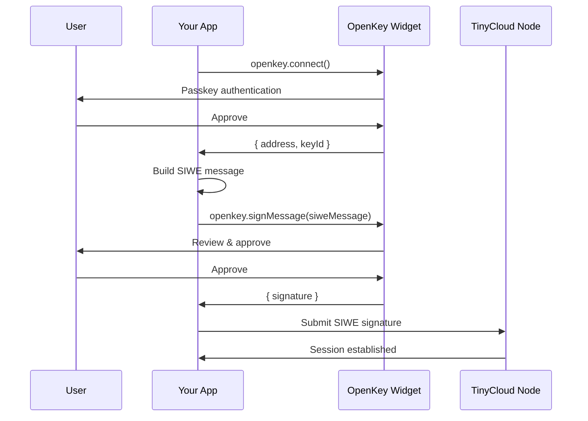

OpenKey can replace browser wallet extensions (MetaMask, WalletConnect, etc.) as the signer for TinyCloud Web SDK. This means users can authenticate to TinyCloud using their OpenKey-managed Ethereum keys, with passkey-based login instead of a browser extension.

## Why Use OpenKey with TinyCloud

- **No browser extension required**: Users do not need MetaMask or any wallet installed
- **Passkey-based authentication**: Biometric or hardware key login instead of seed phrases
- **TEE key security**: Private keys are sealed inside a hardware enclave
- **Lower onboarding friction**: Non-crypto-native users can get started without understanding wallets
- **Same cryptographic guarantees**: OpenKey produces standard Ethereum signatures that TinyCloud verifies the same way as any wallet

## Architecture



Instead of the wallet extension signing the SIWE message, OpenKey's TEE-managed key signs it. From TinyCloud's perspective, the signature is indistinguishable from one produced by MetaMask.

## Setup

<Steps>
<Step title="Install dependencies">

```bash
npm install @tinycloud/web-sdk @openkey/sdk
```
</Step>

<Step title="Initialize OpenKey and TinyCloud">

```typescript
import { OpenKey, OpenKeyEIP1193Provider } from '@openkey/sdk';
import { TinyCloudWeb } from '@tinycloud/web-sdk';

const openkey = new OpenKey({
  appName: 'My TinyCloud App',
});
```
</Step>

<Step title="Connect with OpenKey and create provider">

Use OpenKey to get the user's Ethereum address and create an EIP-1193 provider.

```typescript
// Connect with OpenKey (passkey auth + key selection)
const authResult = await openkey.connect();
console.log('OpenKey address:', authResult.address);

// Create EIP-1193 provider from OpenKey
const provider = new OpenKeyEIP1193Provider(openkey, authResult);
```
</Step>

<Step title="Initialize TinyCloud with OpenKey provider">

Pass the OpenKey provider to TinyCloud and sign in.

```typescript
// Initialize TinyCloud with the OpenKey provider
const tc = new TinyCloudWeb({
  providers: { web3: { driver: provider } },
});

// Sign in - TinyCloud uses OpenKey for signing automatically
await tc.signIn();

console.log('TinyCloud session:', tc.address());
```
</Step>

<Step title="Use TinyCloud normally">

Once signed in, all TinyCloud operations work exactly the same as with a browser wallet.

```typescript
// Store data in the user's space
const putResult = await tc.kv.put('profile', {
  name: 'Alice',
  wallet: 'openkey',
});

// Retrieve data
const getResult = await tc.kv.get('profile');
if (getResult.ok) {
  console.log(getResult.data.data);
}
```
</Step>
</Steps>

## Complete Example

<CodeGroup>
```typescript Vanilla JS
import { OpenKey, OpenKeyEIP1193Provider } from '@openkey/sdk';
import { TinyCloudWeb } from '@tinycloud/web-sdk';

async function main() {
  const openkey = new OpenKey({ appName: 'My App' });

  // Step 1: Connect with OpenKey
  const authResult = await openkey.connect();
  console.log('Connected via OpenKey:', authResult.address);

  // Step 2: Create EIP-1193 provider and initialize TinyCloud
  const provider = new OpenKeyEIP1193Provider(openkey, authResult);
  const tc = new TinyCloudWeb({
    providers: { web3: { driver: provider } },
  });

  // Step 3: Sign in to TinyCloud
  await tc.signIn();
  console.log('TinyCloud session active:', tc.address());

  // Step 4: Use TinyCloud KV storage
  await tc.kv.put('settings', { theme: 'dark', lang: 'en' });
  const result = await tc.kv.get('settings');
  if (result.ok) {
    console.log('Settings:', result.data.data);
  }
}

main().catch(console.error);
```

```tsx React
import { useState } from 'react';
import { OpenKey, OpenKeyEIP1193Provider } from '@openkey/sdk';
import { TinyCloudWeb } from '@tinycloud/web-sdk';

const openkey = new OpenKey({ appName: 'My React App' });
let tc: TinyCloudWeb | null = null;

export default function App() {
  const [address, setAddress] = useState('');
  const [data, setData] = useState(null);

  async function handleSignIn() {
    // Connect with OpenKey
    const authResult = await openkey.connect();
    setAddress(authResult.address);

    // Create EIP-1193 provider and initialize TinyCloud
    const provider = new OpenKeyEIP1193Provider(openkey, authResult);
    tc = new TinyCloudWeb({
      providers: { web3: { driver: provider } },
    });

    // Sign in to TinyCloud
    await tc.signIn();
  }

  async function handleSave() {
    if (!tc) return;
    await tc.kv.put('demo', { timestamp: Date.now() });
    alert('Saved!');
  }

  async function handleLoad() {
    if (!tc) return;
    const result = await tc.kv.get('demo');
    if (result.ok) {
      setData(result.data.data);
    }
  }

  return (
    <div>
      {!address ? (
        <button onClick={handleSignIn}>Sign In with OpenKey</button>
      ) : (
        <>
          <p>Connected: {address}</p>
          <button onClick={handleSave}>Save Data</button>
          <button onClick={handleLoad}>Load Data</button>
          {data && <pre>{JSON.stringify(data, null, 2)}</pre>}
        </>
      )}
    </div>
  );
}
```
</CodeGroup>

## Session Management

Check if there's an existing session before initiating a new sign-in flow:

```typescript
import { OpenKey, OpenKeyEIP1193Provider } from '@openkey/sdk';
import { TinyCloudWeb } from '@tinycloud/web-sdk';

const openkey = new OpenKey({ appName: 'My App' });

// Check if there's an existing session
if (tc.session()) {
  console.log('Session active:', tc.address());
} else {
  // Need to connect with OpenKey and sign in
  const authResult = await openkey.connect();
  const provider = new OpenKeyEIP1193Provider(openkey, authResult);

  const tc = new TinyCloudWeb({
    providers: { web3: { driver: provider } },
  });

  await tc.signIn();
}
```

## Delegations with OpenKey

Delegations work the same way regardless of whether the signer is OpenKey or a browser wallet. The primary DID is derived from the Ethereum address, which is the same whether the key is in MetaMask or OpenKey.

```typescript
// Alice (using OpenKey) delegates to Bob
const delegation = await tc.createDelegation({
  delegateDID: bob.did, // Use the recipient's primary DID (tc.did after signIn)
  actions: ['tinycloud.kv/get', 'tinycloud.kv/list'],
  path: 'shared/',
  expiryMs: 7 * 24 * 60 * 60 * 1000, // 7 days in milliseconds
});
```

<Note>
Use the recipient's primary DID (`tc.did` after signIn) for delegations. This applies regardless of the signer being used. See the [Delegations guide](/guides/delegations) for details.
</Note>

## Comparison: OpenKey vs. Browser Wallet

| Aspect | Browser Wallet (MetaMask) | OpenKey |
|--------|---------------------------|---------|
| **Installation** | Browser extension required | None (web-based) |
| **Key storage** | User's device (local) | TEE (server-side, sealed) |
| **Authentication** | Wallet unlock (password) | Passkey (biometric) |
| **Seed phrase** | User must back up | Not applicable |
| **Signing UX** | Extension popup | OpenKey popup/iframe |
| **Works on mobile** | Requires mobile wallet app | Works in any browser |
| **TinyCloud compatibility** | Native | Via custom signer |

## Next Steps

<CardGroup cols={2}>
  <Card title="Widget Integration" icon="window-maximize" href="/openkey/widget">
    Learn more about the OpenKey widget for connect and sign flows.
  </Card>
  <Card title="OAuth Provider" icon="lock" href="/openkey/oauth">
    Use OpenKey as an OAuth provider for server-side apps.
  </Card>
  <Card title="Authentication Guide" icon="key" href="/guides/authentication">
    Learn more about TinyCloud's SIWE authentication model.
  </Card>
  <Card title="Delegations Guide" icon="share-nodes" href="/guides/delegations">
    Share access to spaces with delegatable capabilities.
  </Card>
</CardGroup>
