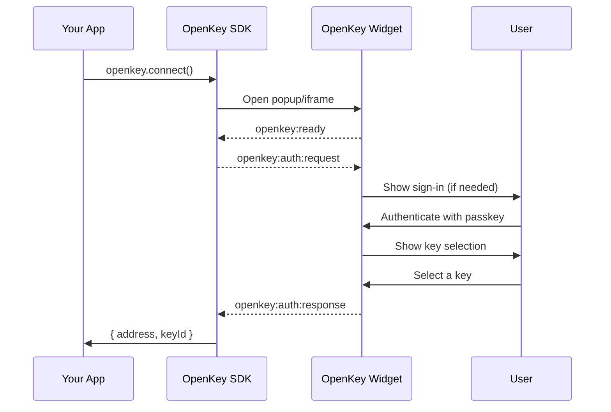

The OpenKey widget lets you add "Connect with OpenKey" and "Sign with OpenKey" functionality to any web application. The widget runs as a popup or iframe overlay, handles the full authentication and signing flow, and returns results to your app via `postMessage`.

## Installation

Install the OpenKey SDK:

```bash
npm install @openkey/sdk
```

## Quick Example

<CodeGroup>
```typescript SDK
import { OpenKey } from '@openkey/sdk';

const openkey = new OpenKey({
  appName: 'My App',
});

// Connect: user selects or creates a key
const { address, keyId } = await openkey.connect();
console.log('Connected:', address);

// Sign a message
const { signature } = await openkey.signMessage({
  message: 'Hello from My App!',
  keyId,
});
console.log('Signature:', signature);
```

```html Vanilla HTML
<script type="module">
  import { OpenKey } from 'https://unpkg.com/@openkey/sdk';

  const openkey = new OpenKey({ appName: 'My App' });

  document.getElementById('connect-btn').onclick = async () => {
    const { address, keyId } = await openkey.connect();
    document.getElementById('address').textContent = address;

    document.getElementById('sign-btn').onclick = async () => {
      const { signature } = await openkey.signMessage({
        message: 'Hello!',
        keyId,
      });
      document.getElementById('signature').textContent = signature;
    };
  };
</script>

<button id="connect-btn">Connect with OpenKey</button>
<p id="address"></p>
<button id="sign-btn" style="display:none">Sign Message</button>
<p id="signature"></p>
```
</CodeGroup>

## SDK Configuration

```typescript
const openkey = new OpenKey({
  // Display name shown in the widget (default: current hostname)
  appName: 'My App',

  // OpenKey host URL (default: https://openkey.so)
  host: 'https://openkey.so',

  // Display mode: 'iframe' | 'popup' | 'redirect'
  // Default: 'iframe'
  mode: 'popup',
});
```

<Tip>
Iframe mode (default) provides a clean inline UX. The SDK automatically falls back to popup mode if the iframe is blocked by CSP. Set `mode: 'popup'` to always use a popup window.
</Tip>

## Connect Flow

The connect flow lets users authenticate with OpenKey and select (or generate) an Ethereum key to share with your app.

```typescript
const { address, keyId, keyType } = await openkey.connect();
```

What happens when `connect()` is called:



The returned `AuthResult` contains:

| Field | Type | Description |
|-------|------|-------------|
| `address` | `string` | Ethereum address of the selected key |
| `keyId` | `string` | Key identifier (use this for signing) |
| `keyType` | `'MANAGED' \| 'EXTERNAL'` | Whether key is TEE-managed or a linked external wallet |

## Link External Wallet

If the user already has an external wallet (like MetaMask), they can link it to their OpenKey account:

```typescript
const { address, keyId } = await openkey.linkWallet();
```

This opens the widget with the wallet linking flow instead of key selection.

## Sign Flow

Once connected, request a message signature from the user.

```typescript
const { signature, address } = await openkey.signMessage({
  message: 'Please sign to verify ownership',
  keyId: 'key-id-from-connect',
});
```

The widget shows the message to the user for confirmation before signing.

### Sign Typed Data (EIP-712)

For structured data signing:

```typescript
const { signature, address } = await openkey.signTypedData({
  domain: {
    name: 'My App',
    version: '1',
    chainId: 1,
  },
  types: {
    Action: [
      { name: 'description', type: 'string' },
      { name: 'timestamp', type: 'uint256' },
    ],
  },
  primaryType: 'Action',
  message: {
    description: 'Transfer 10 USDC',
    timestamp: Math.floor(Date.now() / 1000),
  },
  keyId: 'key-id-from-connect',
});
```

## Error Handling

All SDK methods throw an `OpenKeyError` on failure:

```typescript
try {
  const result = await openkey.connect();
} catch (error) {
  switch (error.code) {
    case 'USER_CANCELLED':
      console.log('User closed the widget');
      break;
    case 'POPUP_BLOCKED':
      console.log('Popup was blocked - prompt user to allow popups');
      break;
    case 'TIMEOUT':
      console.log('Flow timed out (5 minute limit)');
      break;
    case 'NO_KEY':
      console.log('User has no keys');
      break;
    case 'UNAUTHORIZED':
      console.log('Auth failed');
      break;
  }
}
```

| Error Code | Description |
|------------|-------------|
| `USER_CANCELLED` | User closed the popup or clicked cancel |
| `POPUP_BLOCKED` | Browser blocked the popup window |
| `TIMEOUT` | Flow exceeded 5 minutes without completing |
| `NO_KEY` | User has no Ethereum keys |
| `UNAUTHORIZED` | Authentication failed |
| `STATE_MISMATCH` | OAuth state mismatch (possible CSRF) |

## Message Protocol

If you need to integrate without the SDK (for example, in a framework that does not support npm packages), you can communicate with the widget directly using `postMessage`.

### Opening the Widget

Open the widget URL in a popup or iframe:

```javascript
// Connect flow
const popup = window.open(
  'https://openkey.so/widget/connect?origin=' + encodeURIComponent(window.location.origin),
  'openkey',
  'width=400,height=600,popup=true'
);

// Sign flow
const popup = window.open(
  'https://openkey.so/widget/sign?origin=' + encodeURIComponent(window.location.origin),
  'openkey',
  'width=400,height=600,popup=true'
);

// Sign typed data flow
const popup = window.open(
  'https://openkey.so/widget/sign-typed-data?origin=' + encodeURIComponent(window.location.origin),
  'openkey',
  'width=400,height=600,popup=true'
);
```

### Message Types

The widget communicates via these message types:

**Widget to Parent:**

| Type | Direction | Fields | Description |
|------|-----------|--------|-------------|
| `openkey:ready` | Widget to Parent | -- | Widget loaded, send your request |
| `openkey:auth:response` | Widget to Parent | `success`, `address`, `keyId` or `error` | Connect result |
| `openkey:sign:response` | Widget to Parent | `success`, `signature`, `address` or `error` | Sign result |
| `openkey:signTypedData:response` | Widget to Parent | `success`, `signature`, `address` or `error` | Typed data sign result |
| `openkey:close` | Widget to Parent | -- | User closed the widget |

**Parent to Widget:**

| Type | Direction | Fields | Description |
|------|-----------|--------|-------------|
| `openkey:auth:request` | Parent to Widget | `appName` | Request key selection |
| `openkey:sign:request` | Parent to Widget | `message`, `keyId?` | Request message signature |
| `openkey:signTypedData:request` | Parent to Widget | `data` (EIP-712 object) | Request typed data signature |

### Manual Integration Example

```javascript
const OPENKEY_ORIGIN = 'https://openkey.so';

function connectWithOpenKey() {
  return new Promise((resolve, reject) => {
    const popup = window.open(
      `${OPENKEY_ORIGIN}/widget/connect?origin=${encodeURIComponent(location.origin)}`,
      'openkey',
      'width=400,height=600,popup=true'
    );

    function handleMessage(event) {
      if (event.origin !== OPENKEY_ORIGIN) return;

      if (event.data.type === 'openkey:ready') {
        popup.postMessage(
          { type: 'openkey:auth:request', appName: 'My App' },
          OPENKEY_ORIGIN
        );
      }

      if (event.data.type === 'openkey:auth:response') {
        window.removeEventListener('message', handleMessage);
        popup.close();

        if (event.data.success) {
          resolve({ address: event.data.address, keyId: event.data.keyId });
        } else {
          reject(event.data.error);
        }
      }
    }

    window.addEventListener('message', handleMessage);
  });
}
```

## Check Connection Status

Check if the user already has an active OpenKey session:

```typescript
const connected = await openkey.isConnected();

if (connected) {
  // User is already authenticated with OpenKey
}
```

## Cleanup

When you are done, call `disconnect()` to close any open popups or iframes:

```typescript
openkey.disconnect();
```

## Next Steps

<CardGroup cols={2}>
  <Card title="OAuth Provider" icon="lock" href="/openkey/oauth">
    Use OAuth 2.1 for server-side token-based integration.
  </Card>
  <Card title="TinyCloud Integration" icon="cloud" href="/openkey/tinycloud-integration">
    Use OpenKey as the wallet provider for TinyCloud SDK.
  </Card>
</CardGroup>
