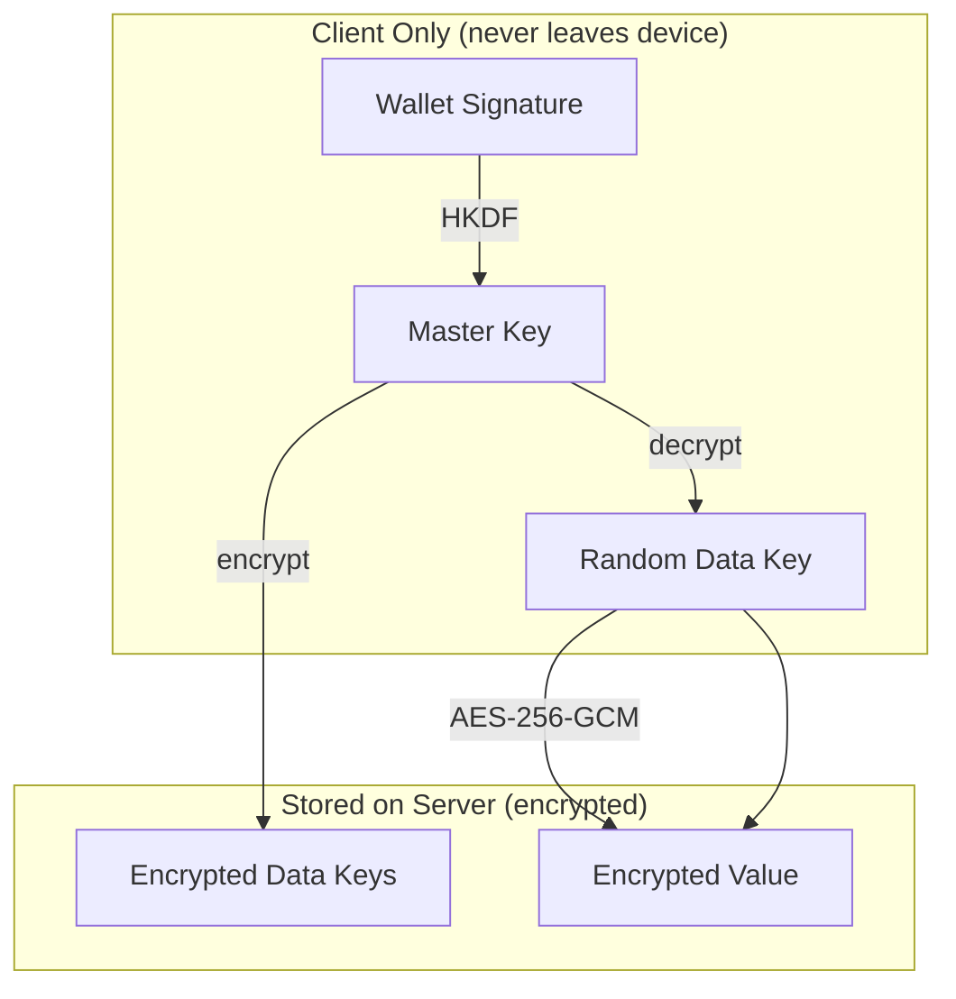
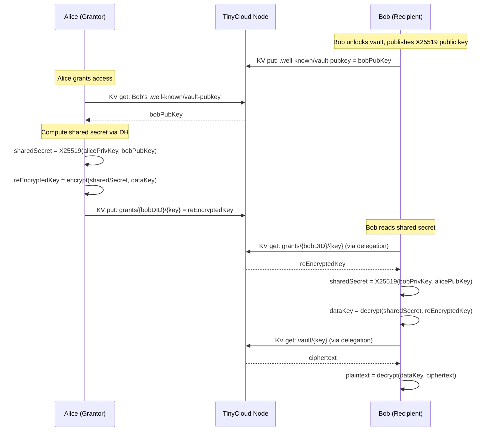

TinyCloud's vault provides end-to-end encrypted storage where the server never has access to plaintext data or encryption keys. This page explains the cryptographic design.

## Overview



## Key Hierarchy

| Key | Purpose | Derivation | Storage |
|-----|---------|-----------|---------|
| **Wallet Signature** | Seed material | User signs a deterministic message | Never stored |
| **Master Key** | Encrypts/decrypts data keys | HKDF from wallet signature | In-memory only (re-derived on unlock) |
| **Data Key** | Encrypts/decrypts one value | Random 32 bytes per entry | Encrypted with master key, stored in KV |
| **X25519 Key Pair** | Sharing via Diffie-Hellman | Derived from seed | Public key published; private key in-memory |

## Encryption Flow

### Storing a Secret

<Steps>
  <Step title="Generate Data Key">
    A random 32-byte data key is generated for this entry using `crypto.getRandomValues()`.
  </Step>
  <Step title="Encrypt Value">
    The plaintext value is encrypted with the data key using AES-256-GCM with a random 12-byte IV.

    ```
    ciphertext = AES-256-GCM(dataKey, plaintext)
    ```
  </Step>
  <Step title="Encrypt Data Key">
    The data key is encrypted with the master key.

    ```
    encryptedDataKey = AES-256-GCM(masterKey, dataKey)
    ```
  </Step>
  <Step title="Store">
    Two KV entries are written:
    - `vault/<key>` — the encrypted value (ciphertext)
    - `keys/<key>` — the encrypted data key

    The server only sees encrypted blobs.
  </Step>
</Steps>

### Retrieving a Secret

<Steps>
  <Step title="Fetch">
    Read `keys/<key>` (encrypted data key) and `vault/<key>` (ciphertext) from KV.
  </Step>
  <Step title="Decrypt Data Key">
    ```
    dataKey = AES-256-GCM-decrypt(masterKey, encryptedDataKey)
    ```
  </Step>
  <Step title="Decrypt Value">
    ```
    plaintext = AES-256-GCM-decrypt(dataKey, ciphertext)
    ```
  </Step>
</Steps>

## Master Key Derivation

The master key is derived deterministically from a wallet signature — the same wallet always produces the same master key.

```
signature = wallet.signMessage("tinycloud-vault-v1")
masterKey = HKDF-SHA256(
    ikm: signature,
    salt: spaceId,
    info: "tinycloud-vault-master-key",
    length: 32
)
```

This means:
- **No key storage needed** — the master key is re-derived each time you unlock
- **Deterministic** — the same wallet + space always produces the same key
- **Space-scoped** — different spaces produce different master keys

## Sharing via X25519

When sharing a secret with another user, the data key is re-encrypted using X25519 Diffie-Hellman key exchange.



### Key Exchange Details

1. **Public key publication**: When a user unlocks their vault, their X25519 public key is published to their public space at `.well-known/vault-pubkey`.

2. **Grant creation**: The grantor fetches the recipient's public key, computes a shared secret via Diffie-Hellman, and re-encrypts the data key with this shared secret. The re-encrypted key is stored at `grants/{recipientDID}/{key}`.

3. **Grant consumption**: The recipient computes the same shared secret (DH is commutative), decrypts the data key, then uses it to decrypt the ciphertext.

### Revocation

When access is revoked:

1. A new random data key is generated
2. The value is re-encrypted with the new data key
3. The old grant is deleted
4. Remaining authorized users are re-granted with the new data key

This ensures the revoked user cannot decrypt the value even if they retained the old grant, because the data key has changed.

## Storage Layout

All vault data is stored in the user's KV space:

| KV Key Pattern | Content | Encrypted? |
|---------------|---------|------------|
| `vault/<key>` | Ciphertext (encrypted value) | Yes (AES-256-GCM with data key) |
| `keys/<key>` | Encrypted data key | Yes (AES-256-GCM with master key) |
| `grants/<did>/<key>` | Re-encrypted data key for recipient | Yes (AES-256-GCM with DH shared secret) |

Public space (readable by anyone):

| KV Key | Content |
|--------|---------|
| `.well-known/vault-pubkey` | X25519 public key (base64) |
| `.well-known/vault-version` | Vault protocol version |
| `.well-known/vault-space` | Space ID where vault data lives |

## Delegation Layer

Vault encryption provides confidentiality. Delegations provide authorization. Both are required for shared access:

| Layer | Purpose | Primitive |
|-------|---------|-----------|
| **Vault Grant** | Cryptographic access — re-encrypts data key to recipient | X25519 DH + AES-256-GCM |
| **Delegation** | Authorization — grants KV read access to grantor's space | SIWE + ReCap capabilities |

A delegation without a vault grant allows reading encrypted blobs but not decrypting them. A vault grant without a delegation provides the decryption key but no way to fetch the ciphertext.

## WASM Implementation

The cryptographic operations (AES-256-GCM, HKDF, X25519) are implemented in Rust and compiled to WebAssembly. This ensures:

- **Consistent behavior** across browser and Node.js
- **Performance** for cryptographic operations
- **Memory safety** from Rust's ownership model
- **No native dependencies** — runs anywhere WASM runs
